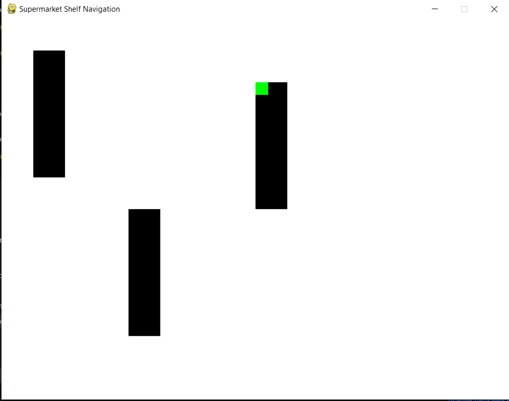

# Cart Billing

Same object identifier modules are used and the billing is performed for every item placed inside the cart

# Cart Navigation

for indoor navigation precise tracking becomes a challenge. Creating a PyGame where their is a certain platform represetning the carpet area of the store and the racks and placed with labels. The coordinates picked up by the IPC used by the customer will be the live location of the player in the game and the customer will receive directions from their current coordinates.

## Sample game:

